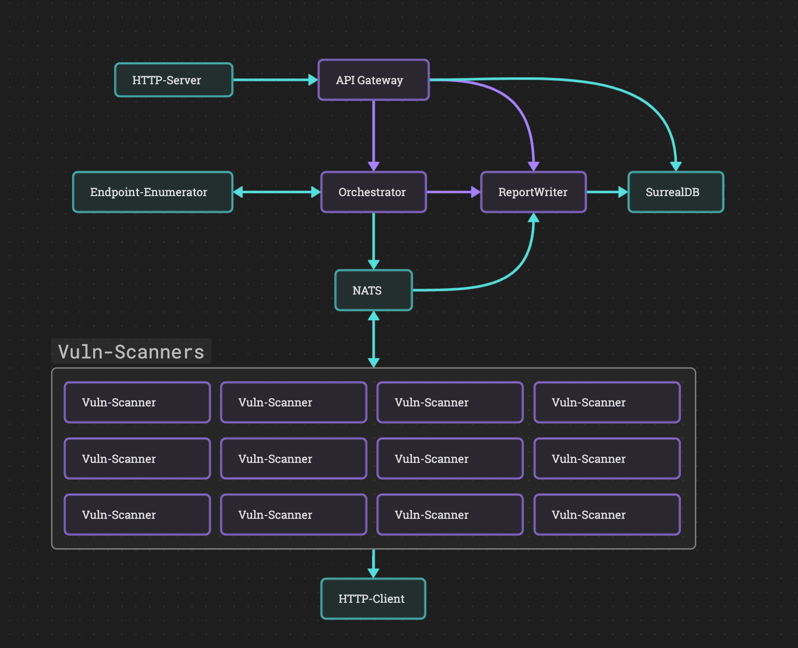

<<<<<<< HEAD
# Overview
> Note: This is a work in progress, and is not yet ready for production use.

A distributed, modular, cloud-native automated vulnerability scanner for bug bounty hunting. The user pushes a queue of
target domains and their endpoints (subdomains + open ports) are enumerated sequentially (or in parallel if this ever 
becomes a paid service), which are then passed to vulnerability scanners to be scanned for common types of vulnerabilities. 

New types of vulnerability scanners can be added without any configuration, thanks to the actor model and 
NATS pub/sub messaging. All types of vulnerability scans run in parallel, and the results are aggregated and written to a
report which is only accessible to the user who submitted the request to scan the target.

## Architecture

Capability providers are shown in blue, and actors in purple. 

Once a request is received by the API Gateway it's passed to the orchestrator actor, which then calls the endpoint 
enumerator. To get around the 2 second timeout on RPC calls the endpoint enumerator spawns a task in the background and 
instantly returns a response to the orchestrator. Once the endpoint enumerator has finished enumerating the endpoints, it
will callback to the orchestrator with the results. 

The orchestrator then publishes a message using NATS to a channel which all vulnerability scanners are subscribed to
(again, to get around the 2 second timeout on RPC calls). Once a vulnerability scanner has finished scanning the
endpoints, it will publish the results to a NATS channel which the report-writer actor is subscribed to. 

The report writer writes these results into the report for the specified job (composed of the UserID, Target and 
RequestTimestamp) using the KV storage provider.

The system can be easily scaled by adding more vulnerability scanner actors and more endpoint enumerator + Http-Client 
providers to the super-constellation, on any cloud provider.  

# TODO
## Necessary for PoC
### General
- [ ] Test on local
- [ ] Test on cosmonic
- [ ] Test scaling on Railway/Digital Ocean

### Actors
- [ ] Implement messaging to handle vulnerability scanner calls and callbacks
- [ ] Implement messaging for report-writer
- [ ] Implement messaging for orchestrator
- [ ] Implement endpoint enumerator callback handling for orchestrator
- [ ] Implement at least 4 different vulnerability scanners

### Providers
#### Endpoint Enumerator
- [x] Implement task queue so multiple targets can be submitted at once, and the provider can work through them with a 
      configurable concurrency value in the link definition

## Nice to haves
- [ ] Open telemetry
- [ ] User authentication + session tokens
- [ ] Front end for login + submitting targets
- [ ] Front end for viewing reports 
- [ ] notifications/emails when reports are ready for a specific vulnerability scanner
- [ ] deploy script
- [ ] It would probably make more sense to use Postgres instead of KV storage for reports, but currently limited
      to only 5 providers on a managed cosmonic host during dev preview; KV storage will have to do for proof of concept.
- [ ] Figure out optimal concurrency values for endpoint enumerator provider
- [ ] Trim down the list of ports, or add a config for endpoint enumerator provider
- [ ] Test scalability with a separate containerised deployment on Railway and Digital Ocean 
      (extra providers on Digital Ocean, extra actors on Railway)
- [ ] Encrypt report data in KV storage + store user private keys in vault
